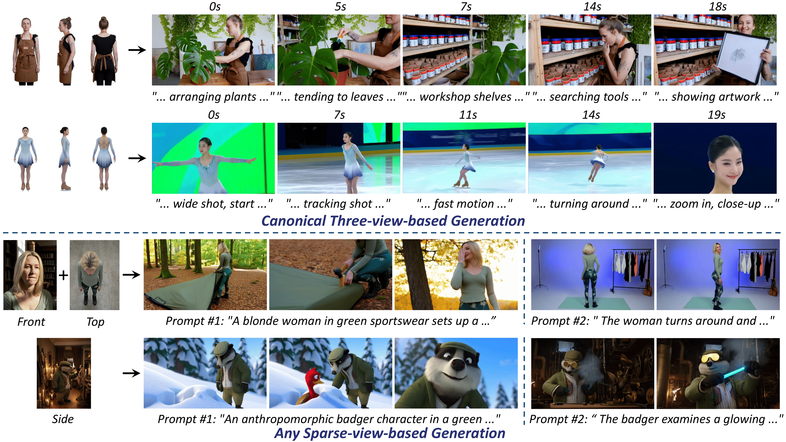

<h1 align="center">WildActor: Unconstrained Identity-Preserving Video Generation</h1>

<p align="center">
  <a href="https://arxiv.org/abs/2603.00586"></a>
  <a href="https://wildactor.github.io/"></a>
  <a href="https://huggingface.co/papers/2603.00586"></a>
  <a href="https://github.com/WildActor/WildActor/tree/main/Actor-18M"></a>
</p>

## 🎬 Teaser

<p align="center">
  
</p>

## 📢 News
* **[2026.03]** Our paper is available on [arXiv](https://arxiv.org/abs/2603.00586)!
* **[2026.03]** Code and data will be released after the base model's release. Stay tuned!

## 📖 Abstract
Production-ready human video generation requires digital actors to maintain strictly consistent full-body identities across dynamic shots, viewpoints and motions, a setting that remains challenging for existing methods. Prior methods often suffer from face-centric behavior that neglects body-level consistency, or produce copy-paste artifacts where subjects appear rigid due to pose locking. We present **Actor-18M**, a large-scale human video dataset designed to capture identity consistency under unconstrained viewpoints and environments. Actor-18M comprises **1.6M videos with 18M corresponding human images**, covering both arbitrary views and canonical three-view representations. Leveraging Actor-18M, we propose **WildActor**, a framework for any-view conditioned human video generation. We introduce an **Asymmetric Identity-Preserving Attention (AIPA)** mechanism coupled with a **Viewpoint-Adaptive Monte Carlo Sampling** strategy. Evaluated on the proposed Actor-Bench, **WildActor** consistently preserves full body identity under diverse shot compositions, large viewpoint transitions, and substantial motions, surpassing existing methods in these challenging settings.

## 🚀 TODO List
- [ ] Release inference code and pre-trained weights.
- [ ] Release the Actor-18M dataset building code.

## 🏃 Quick Start
Inference scripts and detailed usage guidelines will be provided upon the release of the pre-trained weights.

## ✒️ Citation
If you find our work helpful, please consider citing our paper:

```bibtex
@inproceedings{guo2026wildactor,
  title={WildActor: Unconstrained Identity-Preserving Video Generation},
  author={Qin Guo and Tianyu Yang and Xuanhua He and Fei Shen and Yong Zhang and Zhuoliang Kang and Xiaoming Wei and Dan Xu},
  booktitle={Forty-third International Conference on Machine Learning},
  year={2026},
  url={https://openreview.net/forum?id=wXkCkP8TtK}
}
